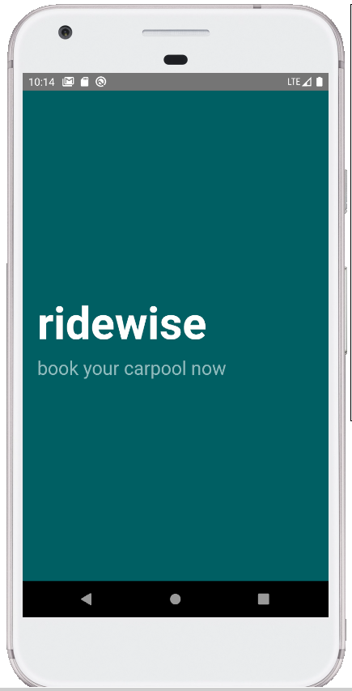
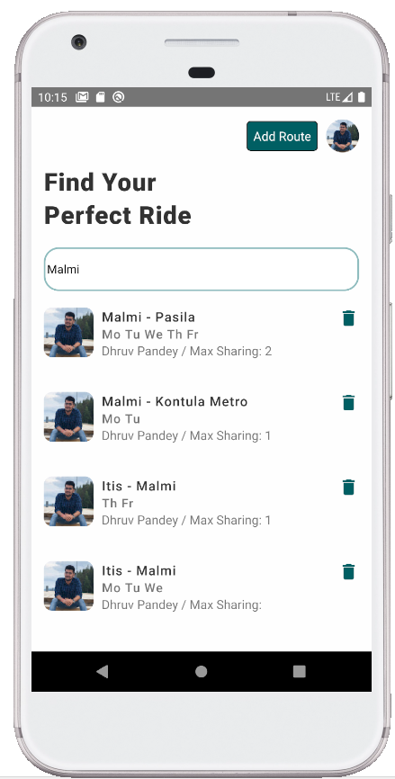
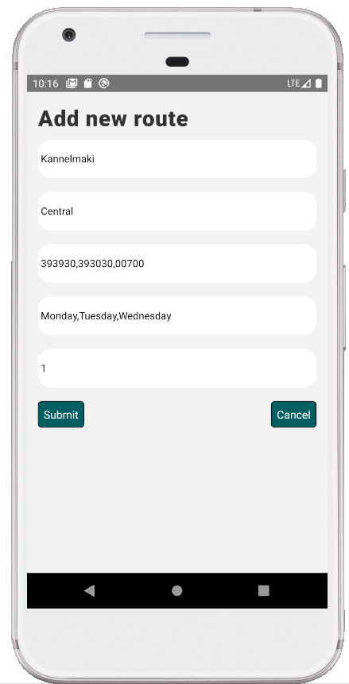
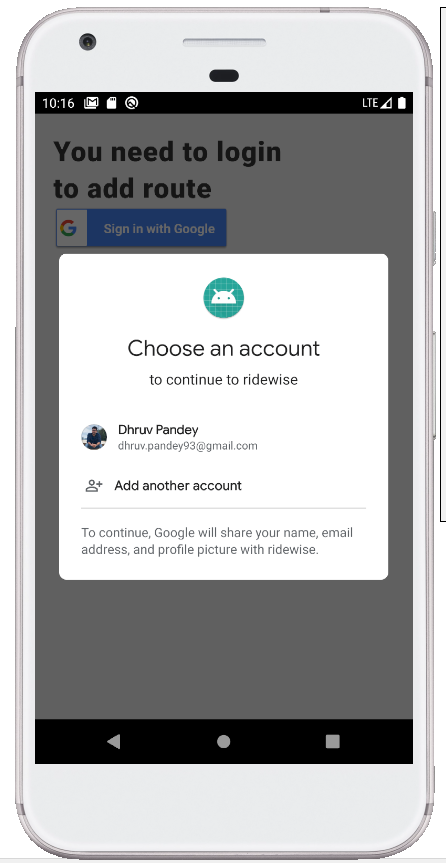
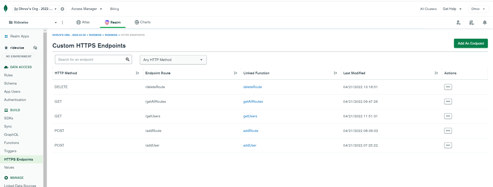
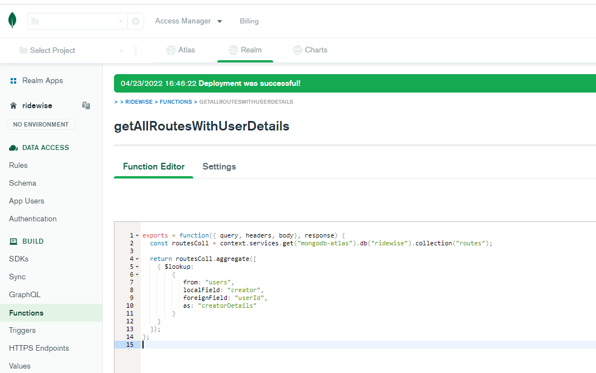

<h2>Web version created in React avaiable here: https://github.com/pdhruv93/ridewise</h2>
<h2>Splash Screen</h2>

<h2>Home screen: List View</h2>

<h2>Add new Route: Formik and Yup</h2>

<h2>Google Sigin</h2>

<h2>MongoDB Atlas for Backend as a service: Custom HTTPS endpoints</h2>

 
<h2>Custom functions in MongoDB Realm</h2>

 

Create new project
=============================
npx react-native init ridewise

Start Metro server
=============================
react-native start --port=8088

Run App
=============================
react-native run-android --port=8088 --deviceId=emulator-5554

Install ESLint
=============================
https://three29.com/set-up-eslint-and-prettier-for-react-native-projects/

Common Errors
==========================
1. Android Gradle plugin requires Java 11 to run. You are currently using Java 1.8.
Check that your system is using Java 11 using java -version. If not change your environment variable.

2. Update your gradle.properties file. You can do it at two places
C:\Users\dhruv.pandey\.gradle . If there is no gradle.properties file create one and add:
org.gradle.java.home=C:\\Program Files\\AdoptOpenJDK\\jdk-11.0.5.10-hotspot

You can also add this property just for your project inside android/gradle.properties

3. Confirm JVM version by going to android and typing
gradlew -version

Check realm file from emulator
=====================================
1. adb -s emulator-5554 shell
2. run-as com.ridewise
3. cd /files/

Git steps
===============================
git init -b main git remote add origin https://github.com/pdhruv93/ridewise-react-native.git git add . && git commit -m "initial commit" && git push git push origin main